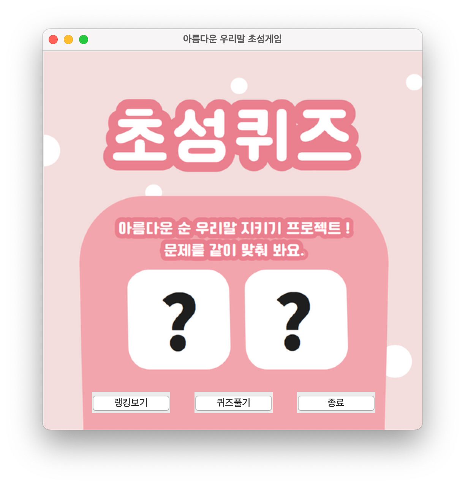
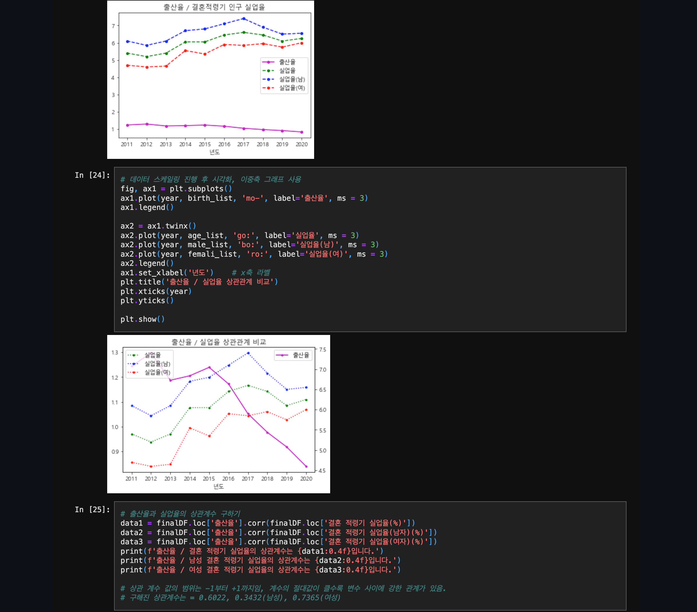
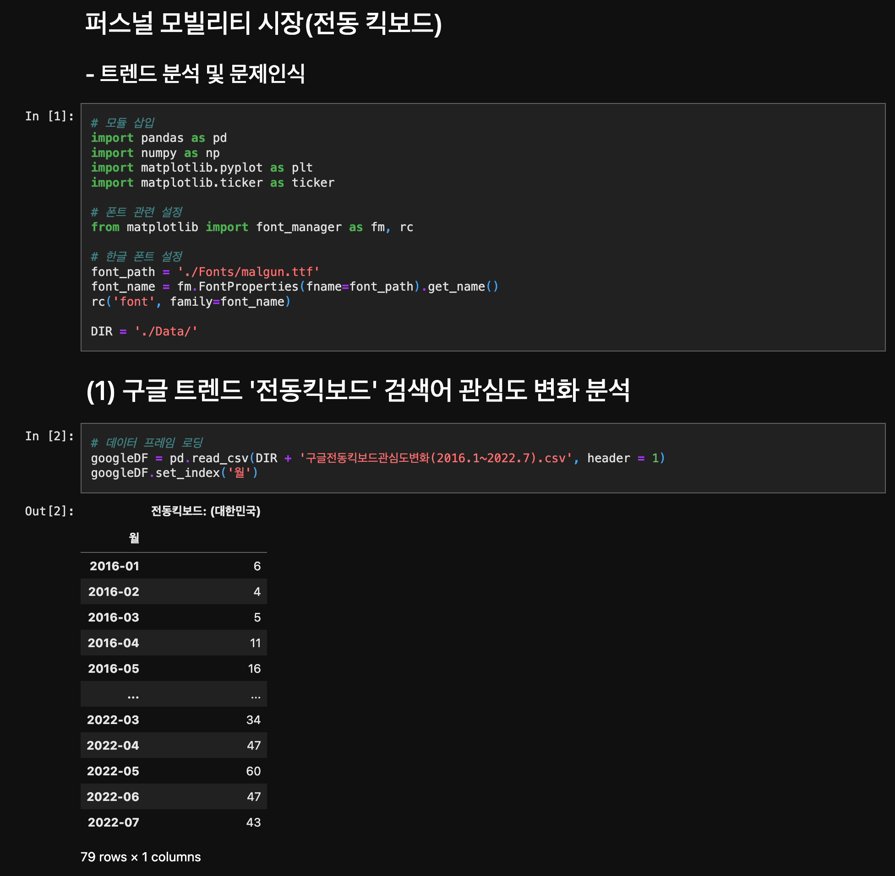
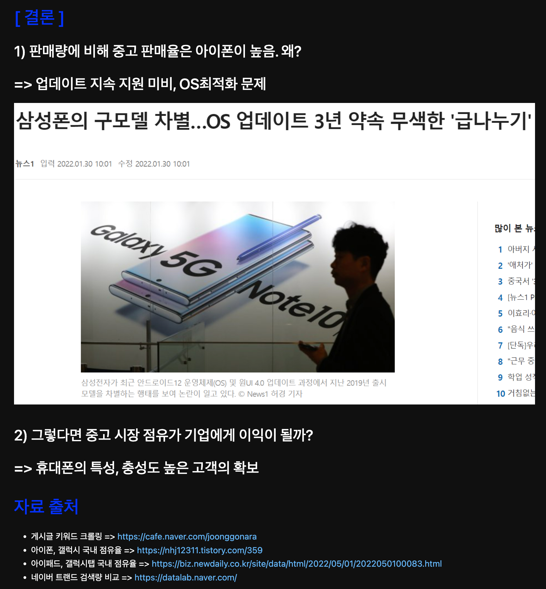
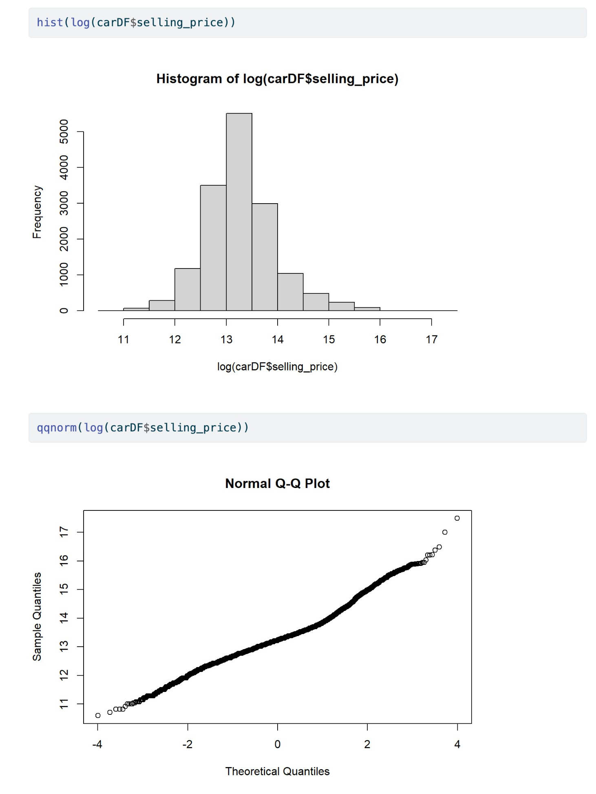
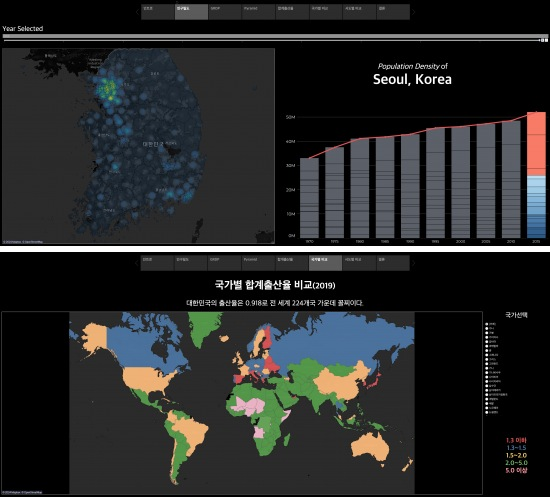
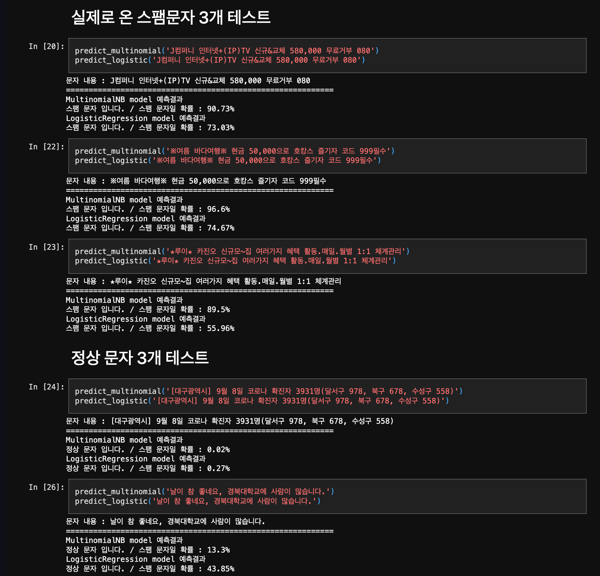
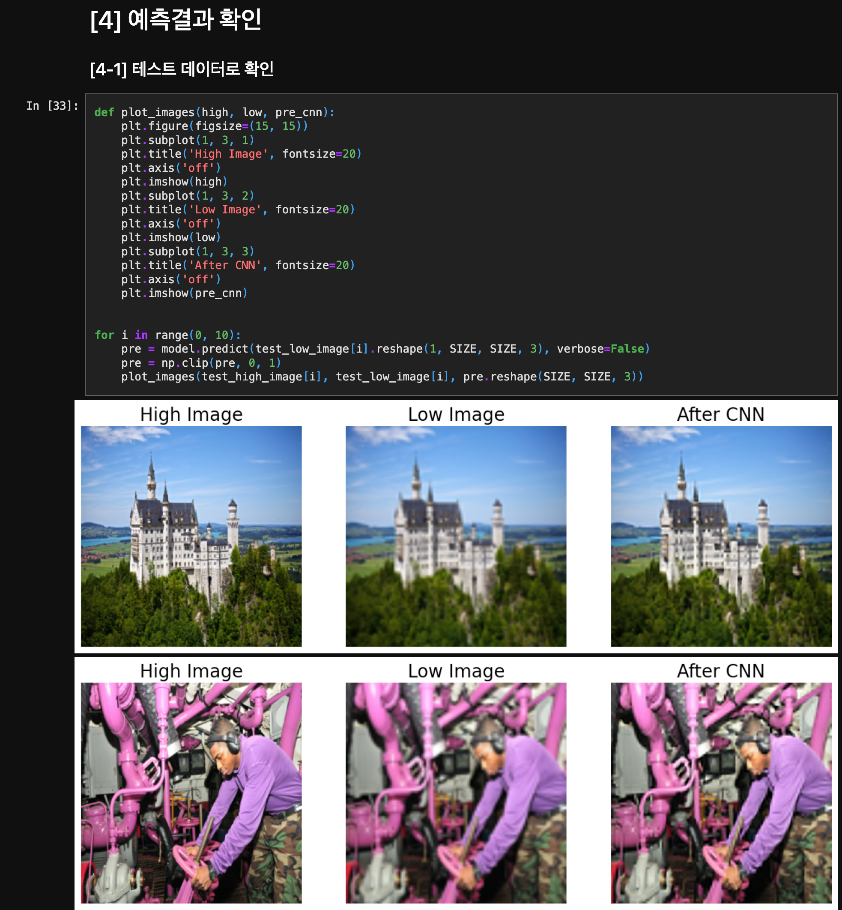

# KDT MINI PROJECT

## 개요

- 경북대학교 빅데이터 분석가 양성과정 2기 미니 프로젝트 정리

## 목차

1. Python
   - 초성 게임 ([링크](https://github.com/jwim5819/KDT_MINI_PROJECT/tree/main/Week_1_ChosungQuiz/Chosung-game))

2. Pandas
   - 실업율 분석 ([링크](https://github.com/jwim5819/KDT_MINI_PROJECT/blob/main/Week_2_PandasProject/%EC%8B%A4%EC%97%85%EC%9C%A8_%EC%9E%84%EC%9E%AC%EC%9B%90.ipynb))

3. Public Data
   - 공유 킥보드 시장 분석 ([링크](https://github.com/jwim5819/KDT_MINI_PROJECT/blob/main/Week_3_PersonalMobility/4%EC%A1%B0_%EC%9E%84%EC%9E%AC%EC%9B%90_%ED%82%A5%EB%B3%B4%EB%93%9C.ipynb))

4. Web Scraping
   - 중고나라 스크래핑 ([링크](https://github.com/jwim5819/KDT_MINI_PROJECT/blob/main/Week_5_WebCrawling/2%EC%A1%B0_%EC%9E%84%EC%9E%AC%EC%9B%90_%EC%A0%84%EC%9E%90%EA%B8%B0%EA%B8%B0.ipynb))

5. R Programing
   - 회귀분석을 이용한 중고차 가격 예측  ([링크](https://github.com/jwim5819/KDT_MINI_PROJECT/blob/main/Week_8_RPrograming/4%EC%A1%B0_%EC%9E%84%EC%9E%AC%EC%9B%90.JPG))

6. Tableau
   - 수도권 인구집중 분석 ([링크](https://public.tableau.com/app/profile/.40333734/viz/_16616976208270/1_1))

7. Machine Learning
   - 스팸문자 분류 ([링크](https://github.com/jwim5819/KDT_MINI_PROJECT/blob/main/Week_11_MachineLearning/3%EC%A1%B0_%EC%9E%84%EC%9E%AC%EC%9B%90_%EC%8A%A4%ED%8C%B8%EB%AC%B8%EC%9E%90%EB%B6%84%EB%A5%98.ipynb))

8. Deep Learning
   - Image Upscaling ([링크](https://github.com/jwim5819/KDT_MINI_PROJECT/blob/main/Week_12_DeepLearning/2%EC%A1%B0_%EC%9E%84%EC%9E%AC%EC%9B%90.ipynb))
